<p align="center">
  
</p>

<p align="center">
  <a href="https://www.pixiv.net/artworks/139667080">
    
  </a>
</p>

<p align="center">
  <sub>「A long walk」— artwork by <a href="https://www.pixiv.net/users/39363802">mmAir</a></sub>
</p>

## `> whoami`

```text
USER       雨晨 / Rainchen
BASE       中国 · 珠海
MISSION    把复杂的事情，做成不打扰人的工具
CURRENT    原生 macOS 应用、系统交互、效率工具
SIGNAL     open to ideas · always building
```

## `> selected_builds`

<table>
  <tr>
    <td width="33%" align="center">
      <a href="https://github.com/Rainchen537/Y-Clip"><br /><strong>Y-Clip</strong></a>
    </td>
    <td width="33%" align="center">
      <a href="https://github.com/Rainchen537/Y-Dock"><br /><strong>Y-Dock</strong></a>
    </td>
    <td width="33%" align="center">
      <a href="https://github.com/Rainchen537/Y-Keys"><br /><strong>Y-Keys</strong></a>
    </td>
  </tr>
</table>

<p align="center">
  <a href="https://github.com/Rainchen537?tab=repositories"><samp>[ 查看全部项目 / EXPLORE ALL BUILDS ]</samp></a>
</p>

## `> telemetry`

<p align="center">
  
  
</p>

<p align="center">
  
</p>

<p align="center">
  
</p>
