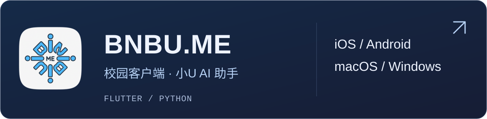

  

<a href="https://www.pixiv.net/artworks/139667080">A long walk</a> · <a href="https://www.pixiv.net/users/39363802">mmAir</a>

<a href="https://bnbu.yunwai.cloud/">
  <picture>
    <source media="(max-width: 600px)" srcset="./assets/project-bnbu-logo.mobile.svg" />
    
  </picture>
</a>

<picture>
  <source media="(max-width: 600px)" srcset="./assets/project-polaris.mobile.svg" />
  
</picture>

<a href="https://github.com/Rainchen537/Y-Clip">
  <picture>
    <source media="(max-width: 600px)" srcset="./assets/project-y-clip.mobile.svg" />
    
  </picture>
</a>

<a href="https://github.com/Rainchen537/Y-Dock">
  <picture>
    <source media="(max-width: 600px)" srcset="./assets/project-y-dock.mobile.svg" />
    
  </picture>
</a>

<a href="https://github.com/Rainchen537/Y-Keys">
  <picture>
    <source media="(max-width: 600px)" srcset="./assets/project-y-keys.mobile.svg" />
    
  </picture>
</a>
