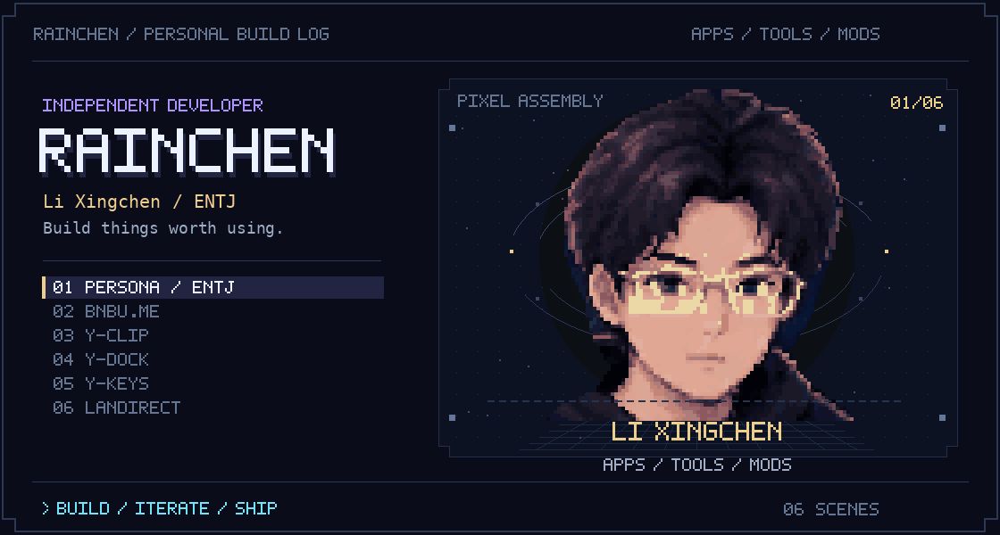
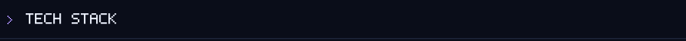
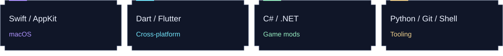
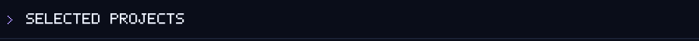
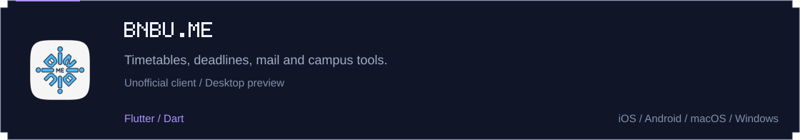
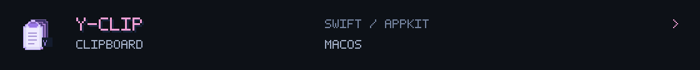
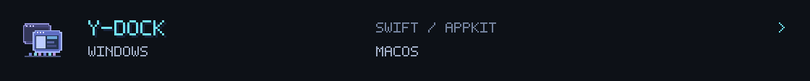
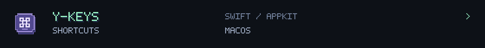
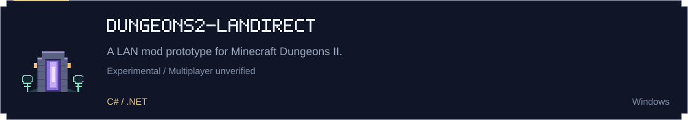
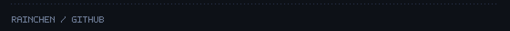

<!-- Generated by tools/build_readme.py. Edit the generator and source artwork. -->

<picture>
  <source media="(prefers-reduced-motion: reduce) and (max-width: 600px)" srcset="./assets/pixel/hero-mobile-poster.png" />
  <source media="(prefers-reduced-motion: reduce)" srcset="./assets/pixel/hero-poster.png" />
  <source media="(max-width: 600px)" srcset="./assets/pixel/hero-mobile.gif" />
  
</picture>

<b>Rainchen / Li Xingchen</b> Independent developer

<a href="#tech-stack">Tech stack</a> · <a href="#selected-projects">Projects</a> · <a href="https://bnbu.me/">BNBU.ME</a> · <a href="./assets/pixel/hero-poster.png">Still cover</a>

<picture>
  <source media="(max-width: 600px)" srcset="./assets/pixel/section-stack-mobile.svg" />
  
</picture>

<picture>
  <source media="(max-width: 600px)" srcset="./assets/pixel/stack-mobile.svg" />
  
</picture>

<picture>
  <source media="(max-width: 600px)" srcset="./assets/pixel/section-projects-mobile.svg" />
  
</picture>

<a href="https://github.com/Rainchen537/BNBUME-client">
<picture>
  <source media="(max-width: 600px)" srcset="./assets/pixel/project-bnbu-mobile.svg" />
  
</picture>
</a>

<a href="https://github.com/Rainchen537/BNBUME-client">Source</a> · <a href="https://bnbu.me/">Website</a>

<a href="https://github.com/Rainchen537/Y-Clip">
<picture>
  <source media="(max-width: 600px)" srcset="./assets/pixel/project-y-clip-mobile.svg" />
  
</picture>
</a>

<a href="https://github.com/Rainchen537/Y-Clip">Source</a> · <a href="https://github.com/Rainchen537/Y-Clip/releases">Releases</a>

<a href="https://github.com/Rainchen537/Y-Dock">
<picture>
  <source media="(max-width: 600px)" srcset="./assets/pixel/project-y-dock-mobile.svg" />
  
</picture>
</a>

<a href="https://github.com/Rainchen537/Y-Dock">Source</a> · <a href="https://github.com/Rainchen537/Y-Dock/releases">Releases</a>

<a href="https://github.com/Rainchen537/Y-Keys">
<picture>
  <source media="(max-width: 600px)" srcset="./assets/pixel/project-y-keys-mobile.svg" />
  
</picture>
</a>

<a href="https://github.com/Rainchen537/Y-Keys">Source</a> · <a href="https://github.com/Rainchen537/Y-Keys/releases">Releases</a>

<a href="https://github.com/Rainchen537/Dungeons2-LanDirect">
<picture>
  <source media="(max-width: 600px)" srcset="./assets/pixel/project-landirect-mobile.svg" />
  
</picture>
</a>

<a href="https://github.com/Rainchen537/Dungeons2-LanDirect">Source</a> · <a href="https://github.com/Rainchen537/Dungeons2-LanDirect#readme">Compatibility</a>

<picture>
  <source media="(max-width: 600px)" srcset="./assets/pixel/footer-mobile.svg" />
  
</picture>

Text version

<b>Rainchen / Li Xingchen</b> — Independent developer. ENTJ is a self-described personality label.

<a href="https://github.com/Rainchen537/BNBUME-client"><b>BNBU.ME</b></a> Timetables, deadlines, mail and campus tools. Flutter / Dart / iOS / Android / macOS / Windows Unofficial client / Desktop preview

<a href="https://github.com/Rainchen537/Y-Clip"><b>Y-Clip</b></a> Clipboard history for macOS. Swift / AppKit / macOS

<a href="https://github.com/Rainchen537/Y-Dock"><b>Y-Dock</b></a> Dock previews and window switching. Swift / AppKit / macOS

<a href="https://github.com/Rainchen537/Y-Keys"><b>Y-Keys</b></a> Shortcut reference for macOS. Swift / AppKit / macOS

<a href="https://github.com/Rainchen537/Dungeons2-LanDirect"><b>Dungeons2-LanDirect</b></a> A LAN mod prototype for Minecraft Dungeons II. C# / .NET / Windows Experimental / Multiplayer unverified

